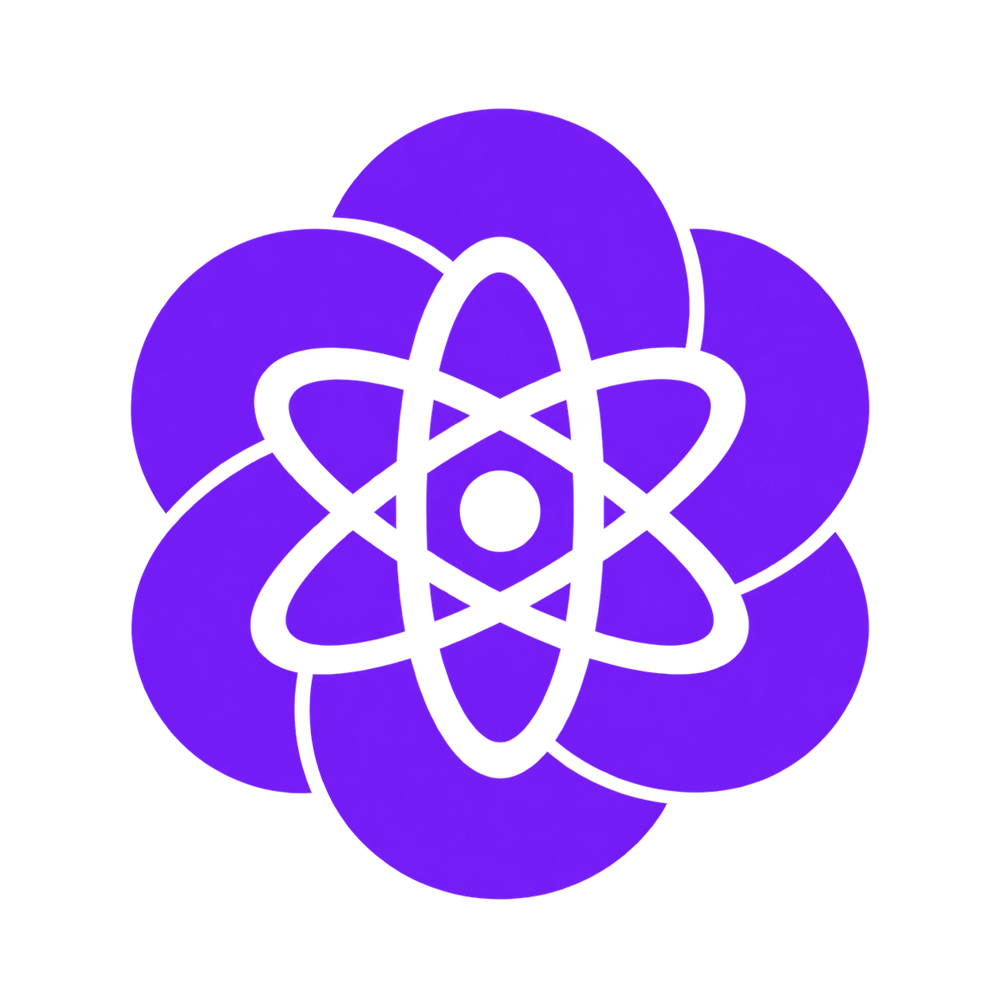

  

# “AI 智能体 + 协会”技术分享会学习资料

> 欢迎来到 AI Agent 的时代，与这个时代最聪明的人和最聪明的模型一起建设 AGI 的未来。

本仓库用于整理 AI 智能体 + 协会在 AI 智能体方向的技术分享、学习资料、实践案例与项目代码，希望为对 AI Agent 感兴趣的同学提供一条从入门到实践的学习路径。

无论你是第一次接触编程，还是已经开始探索 AI 工具，都可以从自己的起点出发，边读资料、边做练习，与我们一起把想法变成现实。

**先掌握工具，再理解原理，最后动手实践。** 线下见面之前，建议先阅读[第 0 章全章节导读](<0 准备开始/0-1 全章节导读.md>)，完成基础工具与操作的准备。

希望我们能一起：

- **一起学习**：从电脑基础操作入手，逐步理解人工智能与智能体，遇到不熟悉的概念就从具体例子开始。
- **一起实践**：学会使用 AI Agent 辅助配置环境、理解代码和排查问题，并亲自运行、检查结果。
- **一起分享**：把操作步骤、报错与解决过程记录下来，让自己的经验也能帮助下一位同学。

学习过程中，不要求你一开始就掌握所有术语。愿意动手、愿意提问、愿意验证，就是很好的起点。

## 下一个“GPT 时刻”

2022 年，ChatGPT 的出现推动了大语言模型的大规模普及，让自然语言第一次真正成为人与计算机交互的重要入口。

2025 年，AI 行业迎来了第二个“GPT 时刻”，智能体开始从概念和实验阶段走向大规模成熟。

相比豆包、DeepSeek 等普通的大语言模型，Agent 不再只是根据输入生成回答，而是可以围绕一个任务进行自动规划，调用外部工具，设计并执行工作流，并在长期使用过程中不断积累经验、形成更加完整的能力体系。

McKinsey 在 2026 年发布的全球 AI 调查显示，在年营收超过 10 亿美元的大型组织中，已经有 **40% 正在规模化部署 AI Agent**；软件开发则是当前 Agent 落地最明显的方向之一。

Agent 带来的变化不仅是“写代码更快”，而是正在改变软件开发中 **人与计算机之间的分工方式**。对于计算机科学、人工智能等专业的学生而言，学习如何设计、使用和管理 Agent，也正在成为新的工程能力。

## 协会发展

学校一直在关注人工智能领域的技术前沿。

2025 年，我们的 AI 智能体 + 协会正式成立，并开始围绕 AI 智能体开展技术学习与项目实践。与此同时，学校也逐渐开展智能体相关课程、平台和应用建设，包括自研智能体以及智能体开发平台等项目。

2026 年，AI 智能体 + 协会进入第二届，我们也开始进一步完善技术培训、项目实践和成员协作体系。

## 仓库目录

### 第 0 章 · 准备开始

这一章帮助你熟悉阅读资料、操作电脑和运行程序所需的基础知识，降低后续学习与沟通的成本。建议按照顺序阅读，打开自己的电脑，对照教程完成操作。

## 一起完善学习资料

欢迎反馈阅读中发现的问题，也欢迎分享自己的操作经验。反馈时请尽量指出具体章节、问题位置和复现步骤；补充案例时，请写清楚所需环境、操作过程与实际结果。

**期待与你一起学习、实践和分享。**
